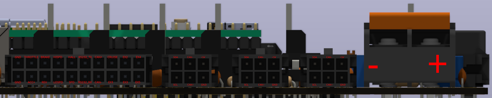
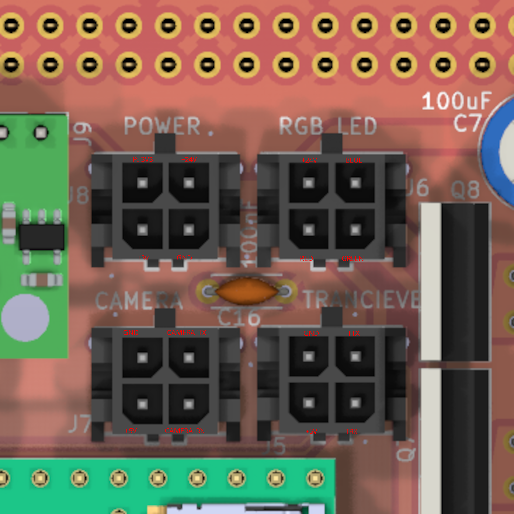
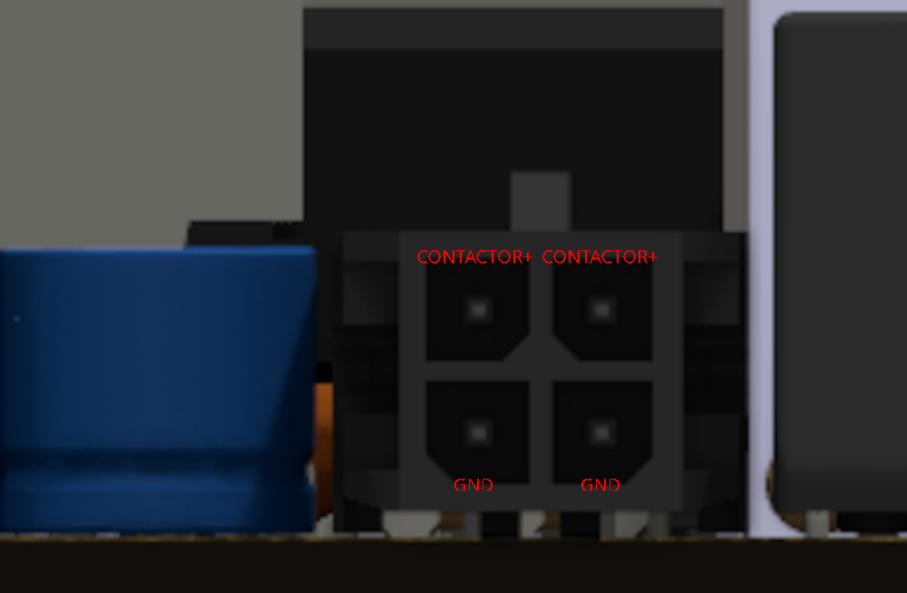

# GPIO Pinouts

  
  
<i>Rear view pinout diagram</i>

  
  
<i>Top view pinout diagram; NOTE: TTX and TRX correspond to the tranciever's TX and RX, not the Teensy's TX and RX. Likewise, CAMERA_TX and CAMERA_RX correspond to the camera's TX and RX.</i>

  
  
<i>Contactor pinout diagram</i>

